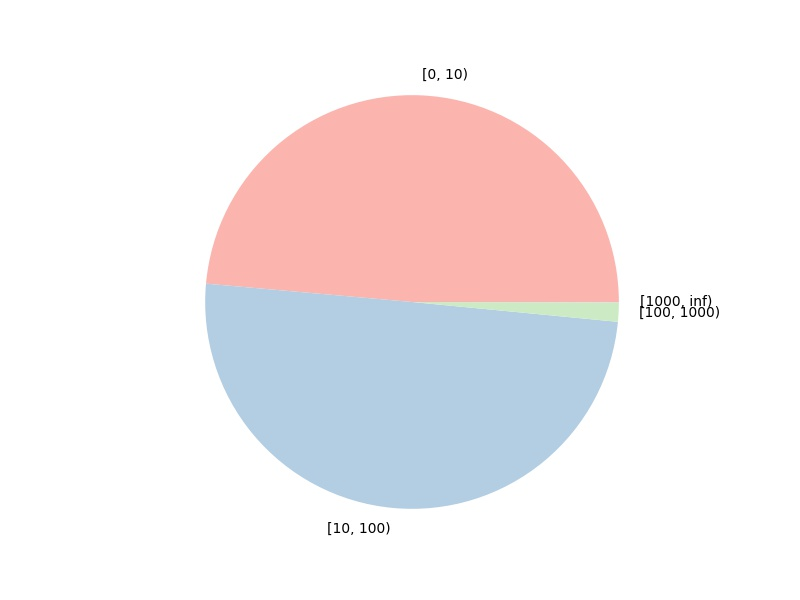

## Problem I: LSH & kNN

*1452669, Yang LI, April 7* 

### Data Propressing

Read data as DataFrame, which indexed by pluno and columned by vipno, basic information shows as follows:

```python
<class 'pandas.core.frame.DataFrame'>
Index: 2635 entries, 10000004 to 40000700
Columns: 298 entries, 13205496418 to 6222021615015662822
dtypes: float64(298)
memory usage: 6.0+ MB
```

To have a basic impression by Data Visualization:

|  |  |
| ---------------------- | ------------------------ |

As we can see, it have 2 points above 1k, which lists as follows:

| vipno         | pluno    | amt    |
| ------------- | -------- | ------ |
| 2900001356947 | 14842010 | 3303.0 |
| 2900000350175 | 15114031 | 1334.0 |

Thus, the distribution of the data can be represented by the Pie Chart as above, details in the  following table:

| amt distribution | count |
| ---------------- | ----- |
| [0, 10)          | 3176  |
| [10, 100)        | 3261  |
| [100, 1000)      | 98    |
| [1000, inf)      | 2     |
| total(not zero)  | 6439  |

### LSH & kNN

Here is the basic 


### Performance


### Screenshot


