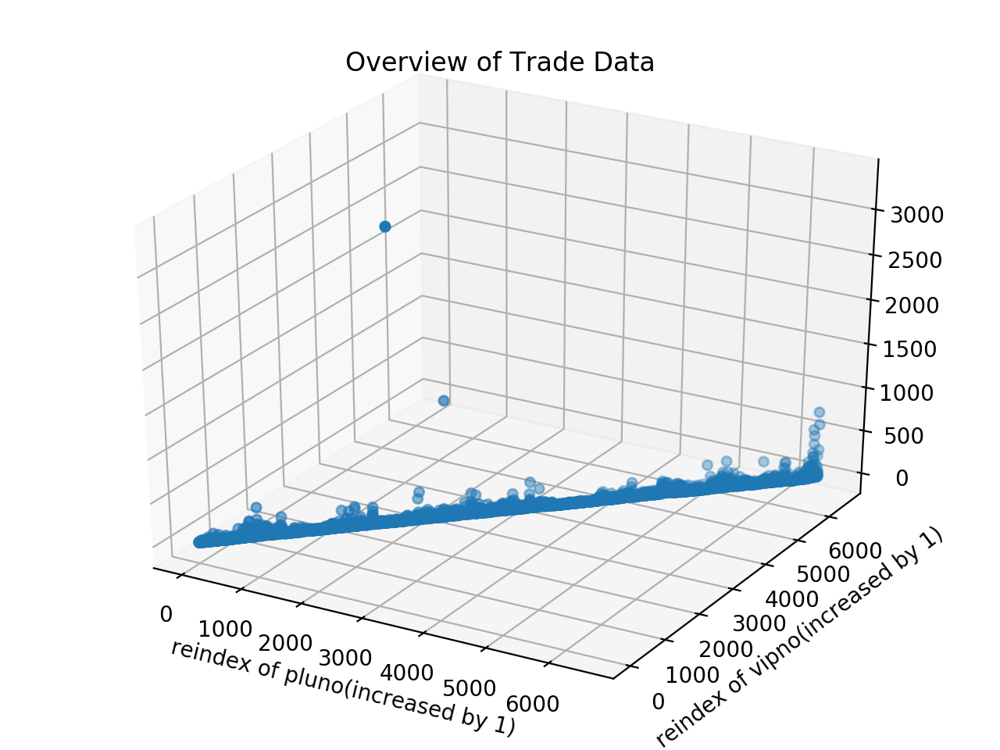
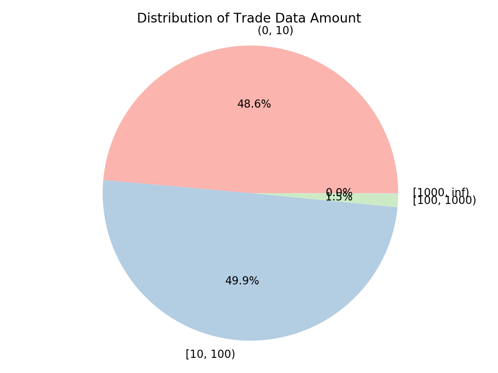
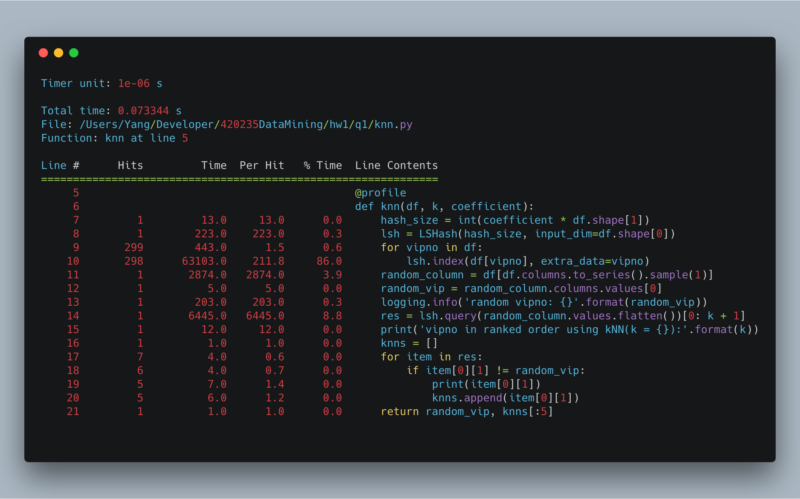
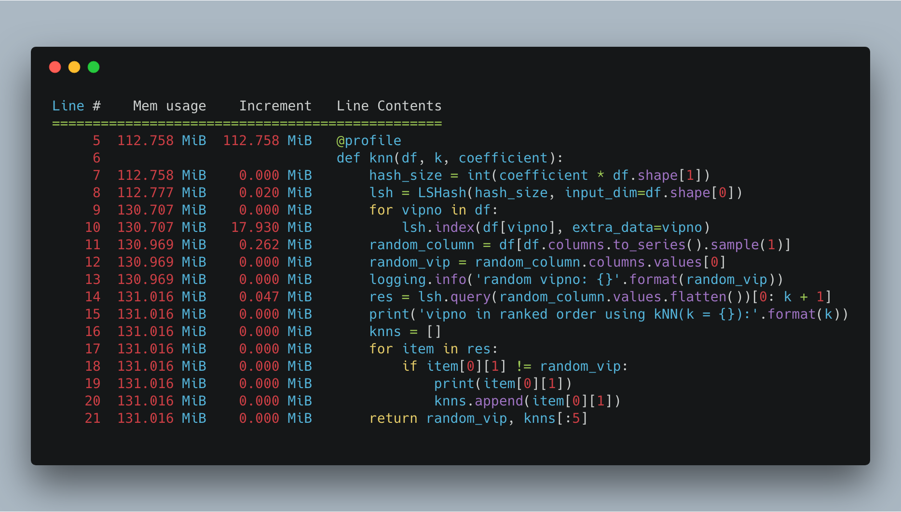
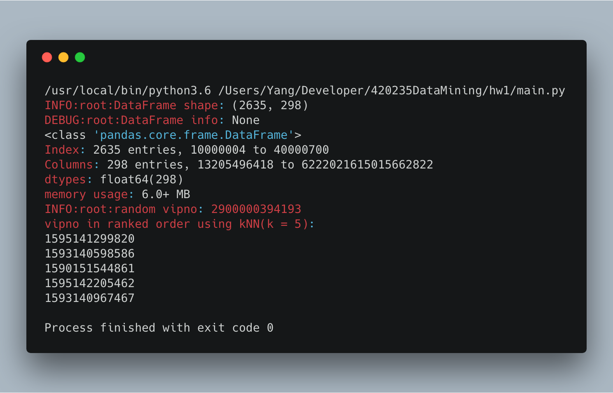
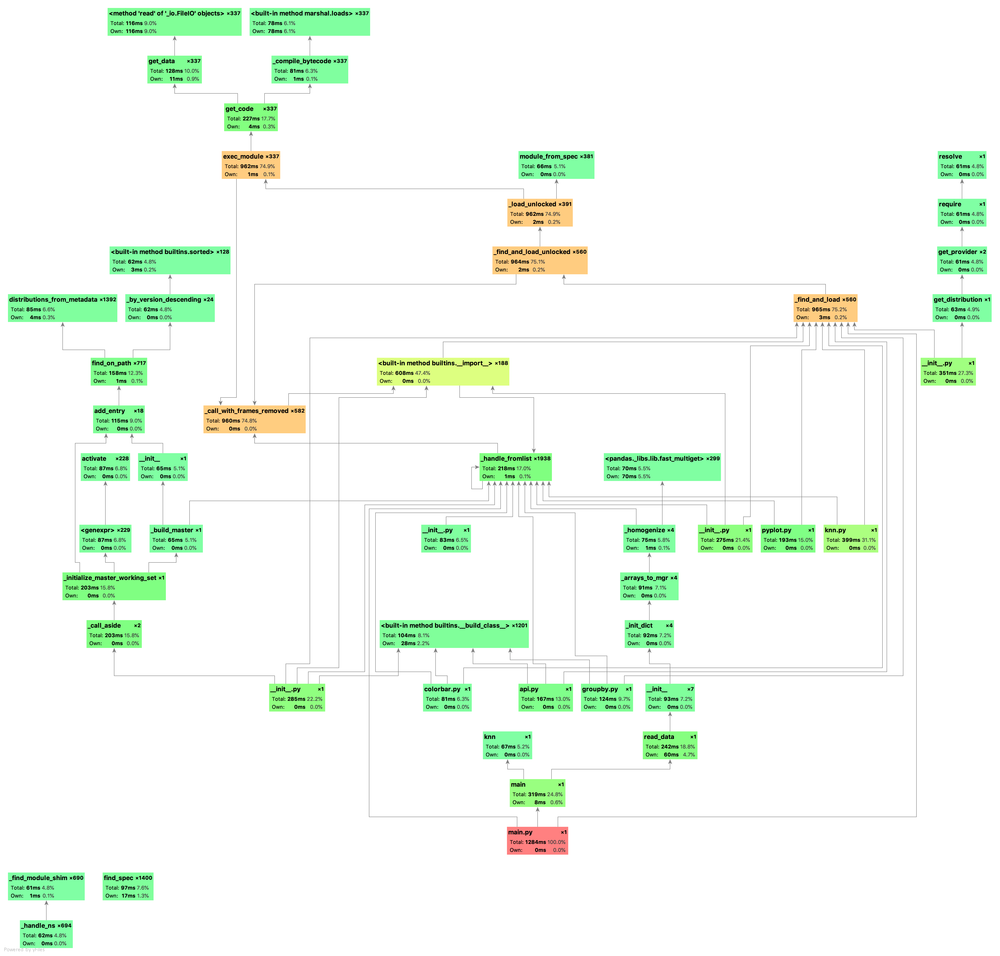

## Problem I: Locality-Sensitive Hashing

*1452669, Yang LI, April 7* 

### Data Overview & Propressing

Read data as DataFrame, which indexed by pluno and columned by vipno, basic information shows as follows:

```python
<class 'pandas.core.frame.DataFrame'>
Index: 2635 entries, 10000004 to 40000700
Columns: 298 entries, 13205496418 to 6222021615015662822
dtypes: float64(298)
memory usage: 6.0+ MB
```

To have a basic impression by Data Visualization:

| Overview of Trade Data | Distribution of Trade Data Amount |
| :--------------------: | :-------------------------------: |
|  |           |

As we can see, it have 2 points above 1k, which lists as follows:

| vipno         | pluno    | amt    |
| ------------- | -------- | ------ |
| 2900001356947 | 14842010 | 3303.0 |
| 2900000350175 | 15114031 | 1334.0 |

Thus, the distribution of the data can be represented by the Pie Chart as above (excluding zero).

### Near Neighbor using LSH

Since I use Euclidean Space, following is a brief introduction of Locality-Sensitive Hashing using s-stable distributions.

Let $f_s(t)$ denote the probability density funtion of the absolute value of the s-stable distribution. For the two vectors $p, q$, let $u = ||p-q||_s$ and let $p(u)$ denote the probility (as a function of $u$) that $p, q$ collide for a hash function uniformly chosen from family. For a radom vector $a$ whose entries are drawn from from s-stable distribution, $a.p - a.q$ is distributed as $cX$ where $X$ is a random variable drawn from a s-stable distribution. Since b is drawn uniformly from $[0, w]$ it is easy to see that

$p(u) = Pr_{a,b}[h_{a,b}(p)=h_{a,b}(q)] = \int_0^w\frac{1}{u}f_s(\frac{t}{u})(1-\frac{t}{w})dt$

In practice, all $L$ hash tables use the same primary hash function $t_1$ (used to dermine the index in the hash table) and the same secondary hash function $t_2$. These two hash functions have the form

$t_1(a_1, a_2, …, a_k) = ((\Sigma_{i=1}^kr_i'a_i) \ mod\ P)\ mod \ \text{tablesize}$

$t_2(a_1, a_2, …, a_k) = (\Sigma_{i=1}^kr_i''a_i) \ mod\ P)$

where $r'$ and $r''$ are random integers, $\text{tablesize}$ is the size of the hash tables, and $P$ is a prime.

In the current usage of the LSHash module, I use `sample` to generate random vipno. Since it is a Approximate Near Neighbor, I remove the generated random vipno carefully (rather than remove the first), and the whole code shows as follows:

```python
def knn(df, k, coefficient):
    hash_size = int(coefficient * df.shape[1])
    lsh = LSHash(hash_size, input_dim=df.shape[0])
    for vipno in df:
        lsh.index(df[vipno], extra_data=vipno)
    random_column = df[df.columns.to_series().sample(1)]
    random_vip = random_column.columns.values[0]
    logging.info('random vipno: {}'.format(random_vip))
    res = lsh.query(random_column.values.flatten())[0: k + 1]
    print('vipno in ranked order using kNN(k = {}):'.format(k))
    knns = []
    for item in res:
        if item[0][1] != random_vip:
            print(item[0][1])
            knns.append(item[0][1])
    return random_vip, knns[:5]
```


### Performance

Here will analyze the performance both in theory and practice.

##### Time & Space Complexity in Theory

Given the parameters $k$ and $L$, the algorithm has the following performance guarantees:

- preprocessing time: $O(nLkt)$, where $t$ is the time to evaluate a function ${\displaystyle h\in {\mathcal {F}}}$ on an input point $p$.
- space: $O(nL)$, plus the space for storing data points.
- query time: $O(L(kt+dnP_2^k)^L)$

##### Benchmark in Practice

As the statistics shows, most time cost in file I/O. In the algorithms part, `index` and `query` cost almost all time, since number of functions $L$ is constant, it takes linear time, which is acceptedable.





### Screenshot



