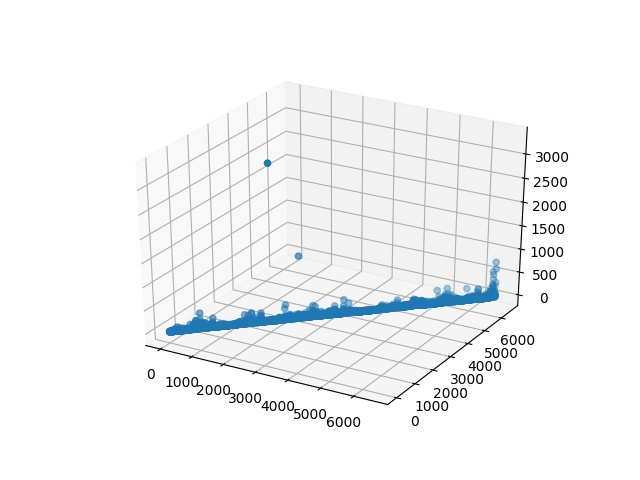

## Problem I: LSH & kNN

*1452669, Yang LI, April 7* 

### Data Propressing

Read data as DataFrame, which indexed by pluno and columned by vipno, basic information shows as follows:

```python
<class 'pandas.core.frame.DataFrame'>
Index: 2635 entries, 10000004 to 40000700
Columns: 298 entries, 13205496418 to 6222021615015662822
dtypes: float64(298)
memory usage: 6.0+ MB
```

To have a basic impression by Data Visualization:



### LSH & kNN


### Screenshot


