## Problem II: K-means Clustering

*1452669, Yang LI, April 7* 

### Data Preprocessing

Since the raw trade data is high dimensional, I use Principal Component Analysis (PCA) to reduce them to a few principal components, in particular,  I use $ 2$ compared with the LSH method using Euclidean Distance. Hence it improve the average silhouette obviously.

### K-means

K-means is the basic and comprehensive clustering algorithm, it accepts an initial set of $k$ means $m_1^{(1)}, m_2^{(1)}, …, m_k^{(1)}$, and proceeds by alternating between two steps:

- Assignment: Assign each observation to the cluster whose mean has the least squared Euclidean distance.

  $S_i^{(t)} = \{x_p:||x_p - m_i^{(t)}||^2 \leq ||x_p - m_j^{(t)}||^2 \ \forall j, 1 \leq j \leq k\}$

  where each $x_p$ is assigned to exactly one $S^{(t)}$, even if it could be assigned to two or more of them.

- Update: Calculate the new means to be the centroids of the observations in the new clusters.

  $m_i^{(t+1)} = \frac{1}{|S_i^{(t)}|}\Sigma_{x_j \in S_i^{(t)} } x_j$ 

```python
def kmeans(df, random_vip, knns):
    k = int(math.sqrt(df.shape[1] / 2))
    silhouette_avgs = []

    for n_clusters in range(2, k + 2):
        logging.debug("K-means: n_clusters = {}".format(n_clusters))
        clusterer = KMeans(n_clusters=n_clusters)
        X = PCA(n_components=2, whiten=True).fit_transform(df.T)
        cluster_labels = clusterer.fit_predict(X)
        silhouette_avg = silhouette_score(X, cluster_labels)
        silhouette_avgs.append(silhouette_avg)
        print("For n_clusters =", n_clusters,
              "The average silhouette_score in K-means is :", silhouette_avg)

        # if n_clusters >= k / 2:
        #     plot_silhouette(X, cluster_labels, n_clusters, clusterer)

        res = 0
        no = cluster_labels[df.columns.get_loc(random_vip)]
        for neighbor in knns:
            if cluster_labels[df.columns.get_loc(neighbor)] == no:
                res += 1
            else:
                logging.info(
                    "K-means: vipno: {} is not in the same cluster.".format(
                        neighbor))
        print(
            "For k = {} in kNN, there has {} in the same cluster in K-means.".format(
                len(knns), res))

    # plot_kmeans_clusterno(k, silhouette_avgs)

    return silhouette_avgs.index(max(silhouette_avgs)) + 2
```

The silhouette analysis results for different clusters show as follows:

| 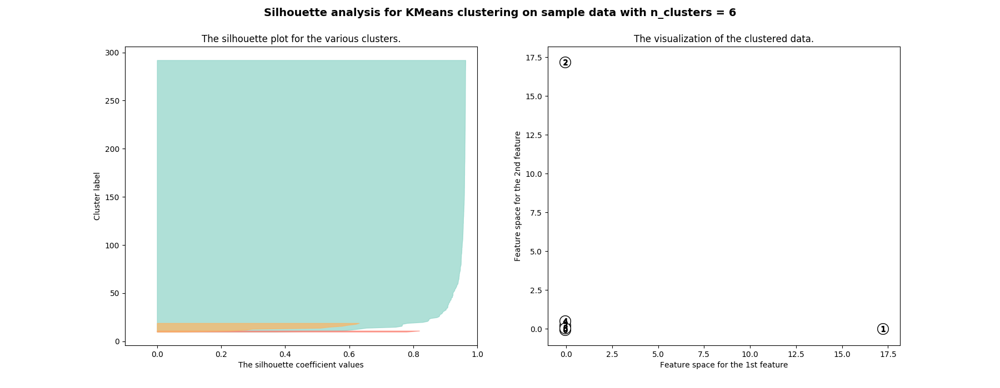  | 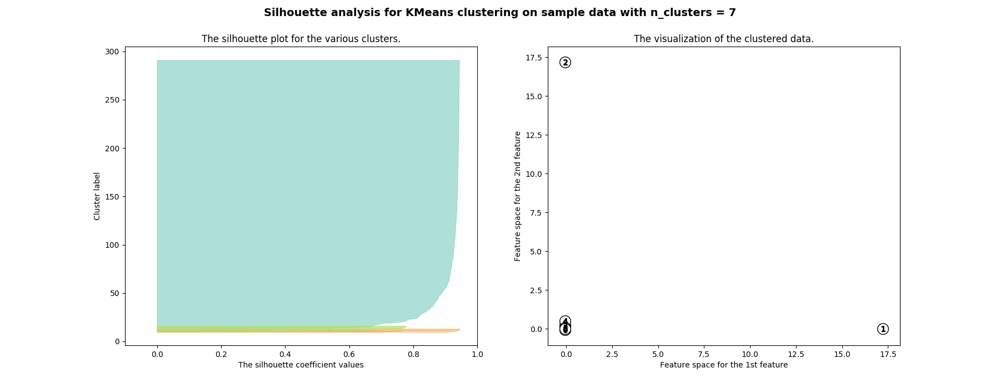  |
| ------------------------------ | ------------------------------ |
| 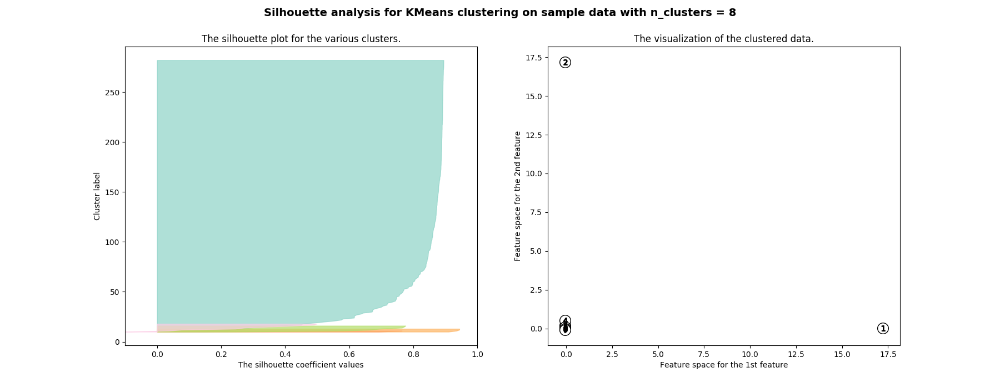  | 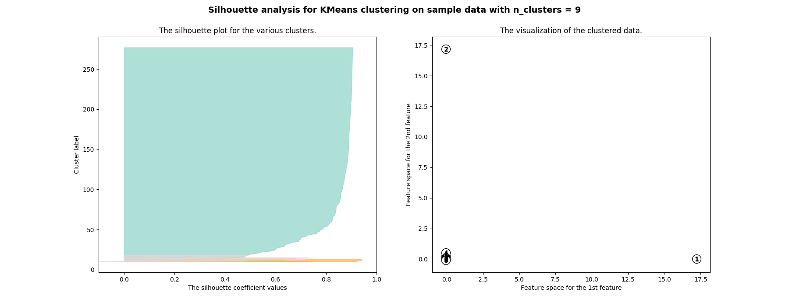  |
| 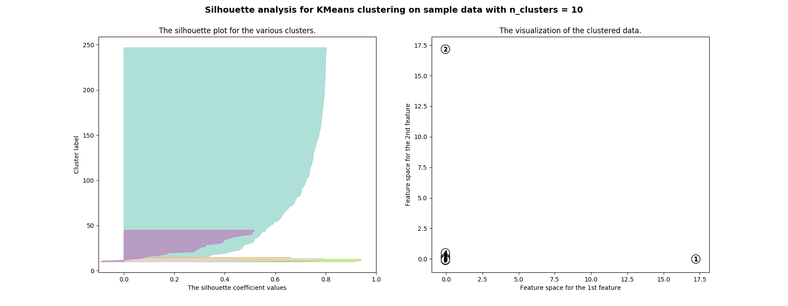 | 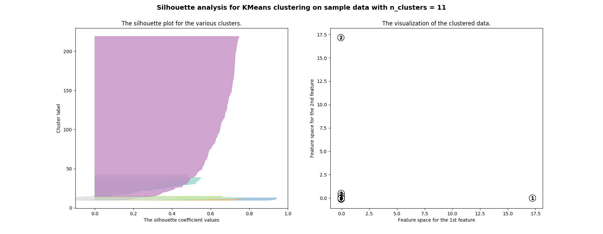 |
| 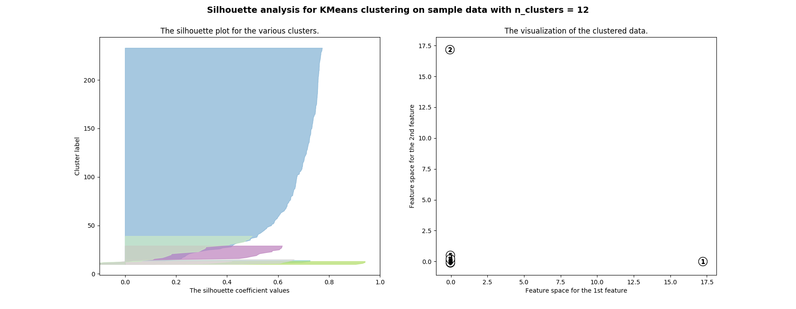 | 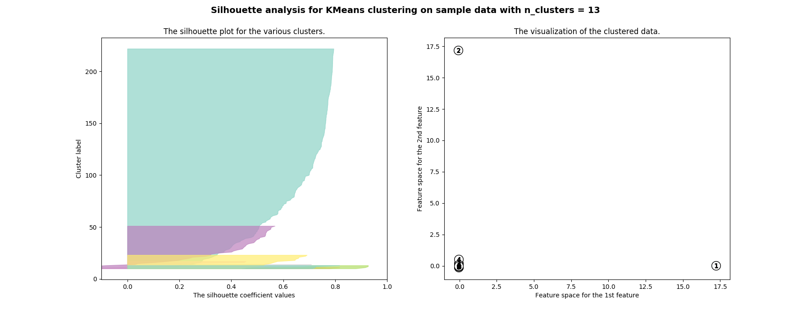 |

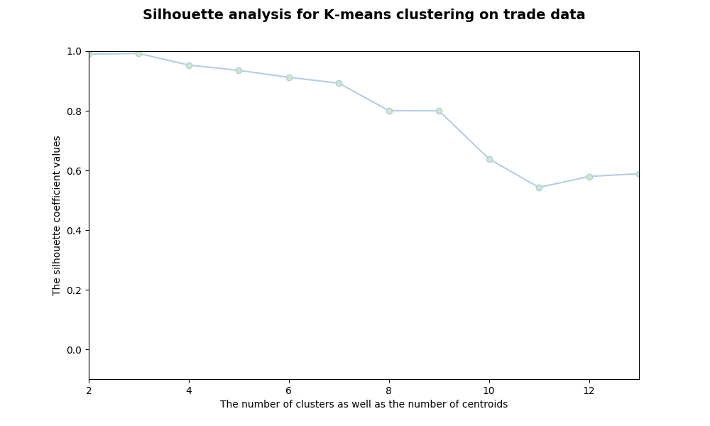

Above figures intuitively indicate the number of clusters in the trade dataset, like $9$ for example. The exact silhouette score are in the following table.

| number of clusters | silhouette score   |
| ------------------ | ------------------ |
| 2                  | 0.9898142095520185 |
| 3                  | 0.9921749295434477 |
| 4                  | 0.9532367585544059 |
| 5                  | 0.9354793995672006 |
| 6                  | 0.912177772818011  |
| 7                  | 0.8925583120466012 |
| 8                  | 0.8003854540541915 |
| 9                  | 0.8001215931883985 |
| 10                 | 0.6280774320073931 |
| 11                 | 0.5553540967764518 |
| 12                 | 0.6433141132870174 |
| 13                 | 0.6210252967296004 |

Compared with the clustering of kNN using LSH, the result are in the following table (duplicate 100 times):

| k    | correctness |
| ---- | ----------- |
| 2    | 1.0         |
| 3    | 0.99        |
| 4    | 0.98        |
| 5    | 0.948       |
| 6    | 0.938       |
| 7    | 0.938       |
| 8    | 0.928       |
| 9    | 0.926       |
| 10   | 0.798       |
| 11   | 0.79        |
| 12   | 0.75        |
| 13   | 0.766       |

### Performance

##### Time & Space Complexity in Theory

Let $t_{dist}$ be the time to calculate the distance between two objects, $K$ stands for the number of clusters (centroids) and $n$ stands for the number of objects. Thus, given bound number of iterations $I$.

- time complexity: $O(IKnt_{dist})$ = $O(IKnm)$ where $m$ means for m-dimensional vectors.
- space complexity: $O((n+K)m)$

##### Benchmark in Practice

Using the common algorithm for K-means clustering, it is a polynomial even though finding the optimal solution to the k-means problem is NP-hard. As we analyzed above, the Lloyd's algorithm is not the global optimum, it always gets a local maximum which differs from the random chosen at the beginning.

In practice, given a bound number of iteration, it cost both in data preprocessing and the finding and calculation of centroids parts.

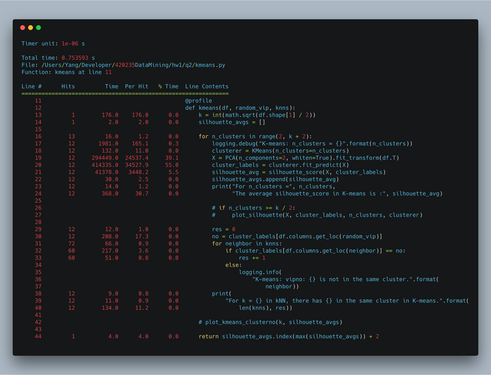

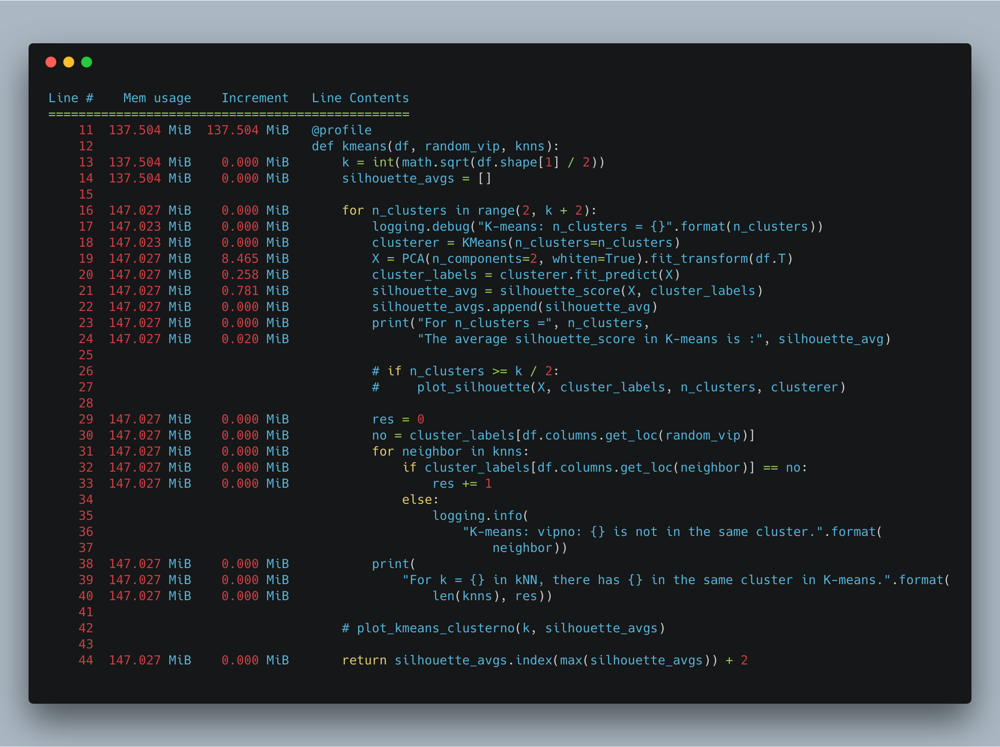

### Screenshot

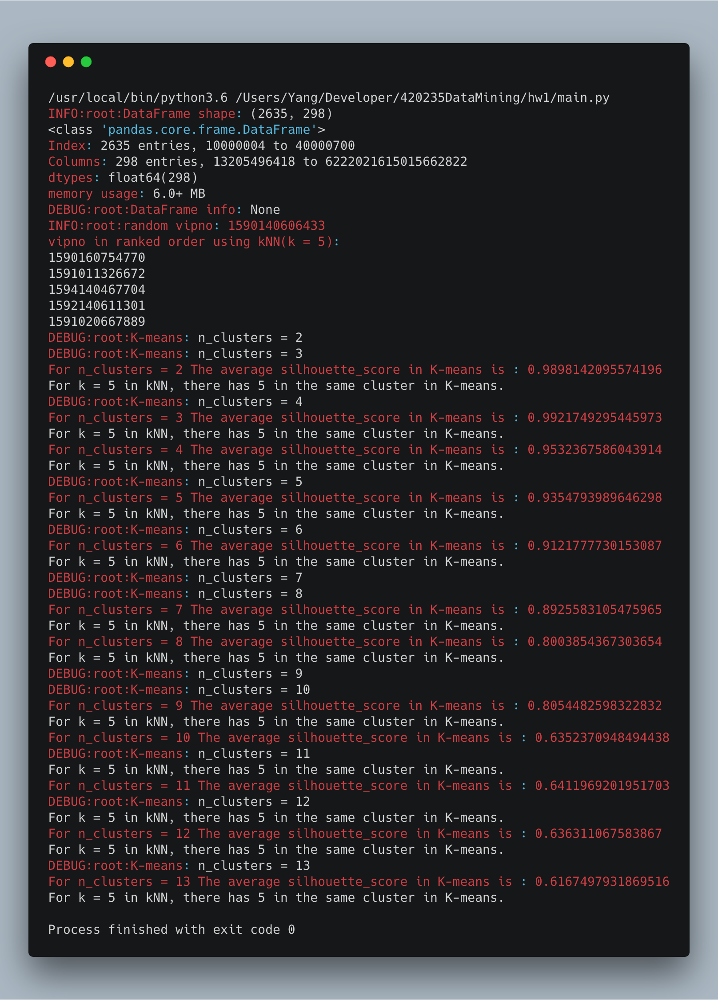

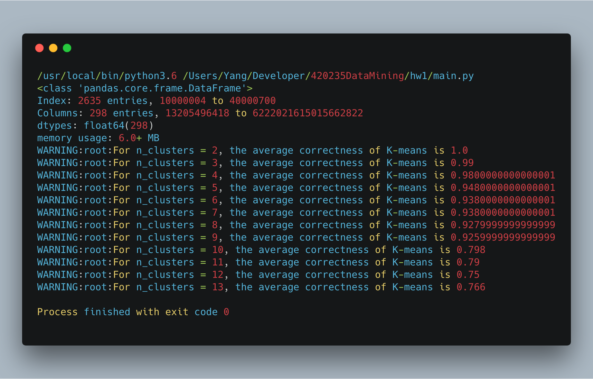

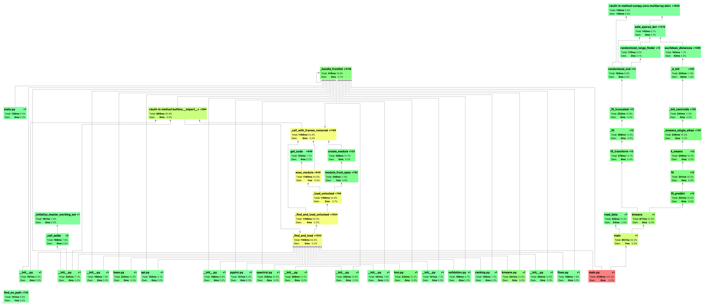