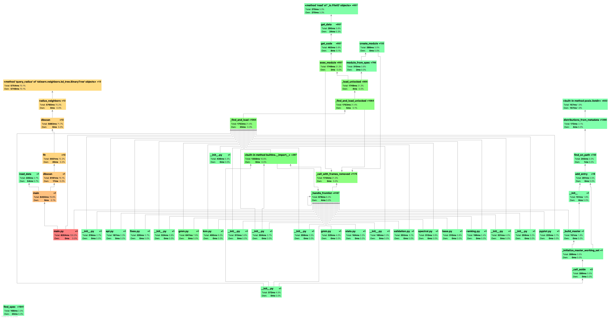

## Problem III: DBSCAN

*1452669, Yang LI, April 8* 

### Data Preprocessing

Since the quality of DBSCAN depends on the distance measure used in the function `regionQuery`. The most common distance metric, as I did, used is Euclidean Distance, Especially for high-dimensional data, this metric can be rendered almost useless due to the Curse of Dimensionality, making it difficult to find an appropriate value for eps.

As a response, I use standardization for data preprocessing. `sklearn` provides a class `StandardScaler` to do a Z-score standardization, which has mean $0$ and standard deviation $1$. Thus, the standard score of a raw score as follows:

$z = \frac{x - \mu}{\sigma}$

### DBSCAN

1. Find the ε (eps) neighbors of every point, and identify the core points with more than minPts neighbors.
2. Find the connected components of *core* points on the neighbor graph, ignoring all non-core points.
3. Assign each non-core point to a nearby cluster if the cluster is an ε (eps) neighbor, otherwise assign it to noise.

Detailed result data listed in the following table:

| eps  | silhouette score      | eps  | silhouette score    |
| ---- | --------------------- | ---- | ------------------- |
| 10   | -0.31939086805466427  | 80   | 0.4067160039619981  |
| 20   | -0.1942397862954418   | 90   | 0.43392130605710816 |
| 30   | -0.029129862530624537 | 100  | 0.4576647790706404  |
| 40   | 0.08708130699171691   | 110  | 0.4883338136442235  |
| 50   | 0.20268451888941394   | 120  | 0.5001686210200447  |
| 60   | 0.2775394743004492    | 130  | 0.5243956411873608  |
| 70   | 0.3387778176593896    |      |                     |

Compared with the clustering of kNN using LSH, the result are in the following table (duplicate 100 times):

| k    | correctness |
| ---- | ----------- |
| 2    | 0.792       |
| 3    | 0.514       |
| 4    | 0.444       |
| 5    | 0.484       |
| 6    | 0.654       |
| 7    | 0.798       |
| 8    | 0.878       |
| 9    | 0.93        |
| 10   | 0.94        |
| 11   | 0.97        |
| 12   | 1           |
| 13   | 1           |

#### K-means vs DBSCAN

As for the clustering result, K-means's silhouette score is much better than DBCSAN may due to that DBSCAN is not entirely deterministic and have Curse of Dimensionality in our high dimension dataset.

Thus, DBSCAN cannot cluster data sets well with large differences in densities, since the minPts-ε combination cannot then be chosen appropriately for all clusters.

In the other part, DBSCAN does not require one to specify the number of clusters in the data a priori. It can find arbitrarily shaped clusters. It can even find a cluster completely surrounded by (but not connected to) a different cluster. Due to the MinPts parameter, the so-called single-link effect (different clusters being connected by a thin line of points) is reduced. Thus, DBSCAN has a notion of noise, and is robust to outliers and can be used with databases that can accelerate region queries.

### Performance

##### Time & Space Complexity in Theory

- time complexity
  - average case: $O(nlgn)$
  - worst case: $O(n^2)$
- space complexity: $O(n^2)$ to store distance matrix

##### Benchmark in Practice

### Screenshot

