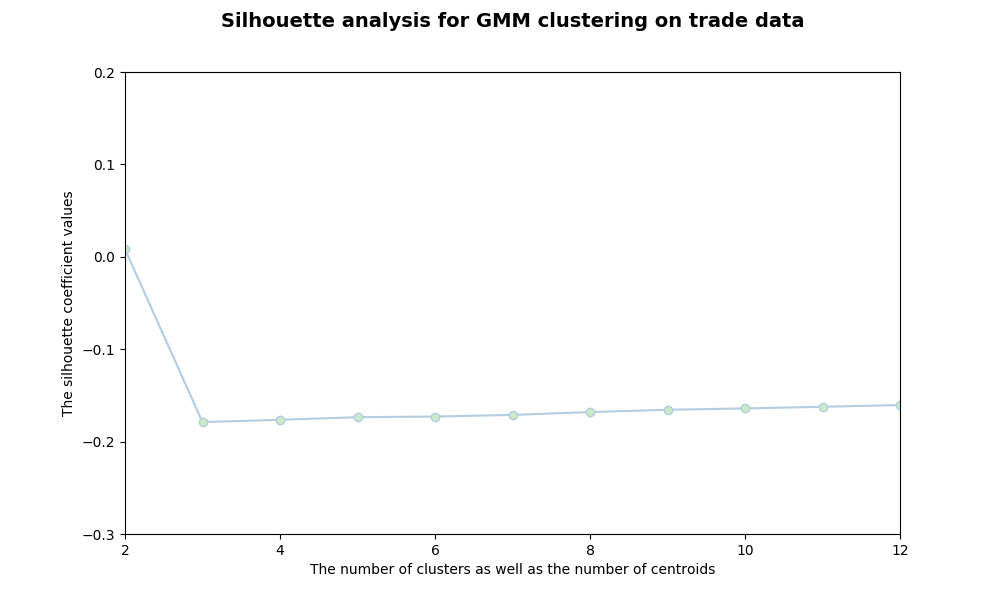
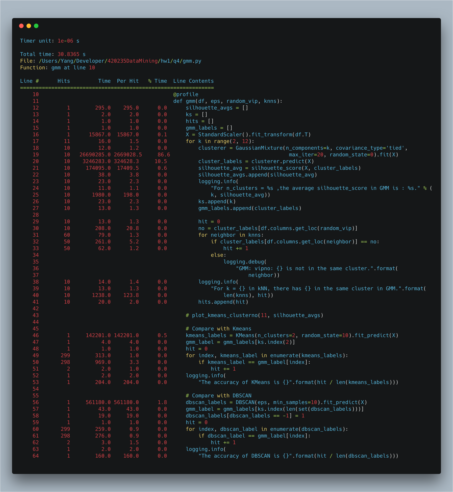
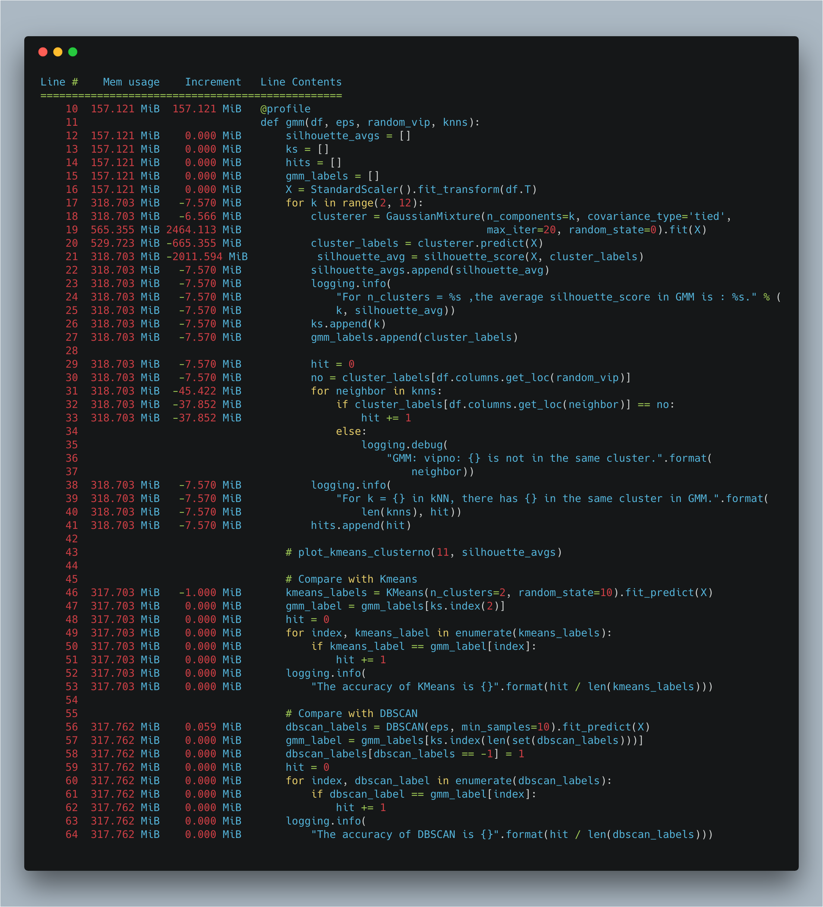
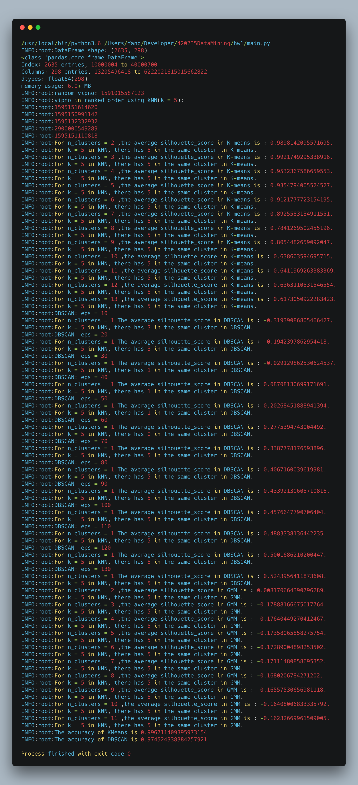
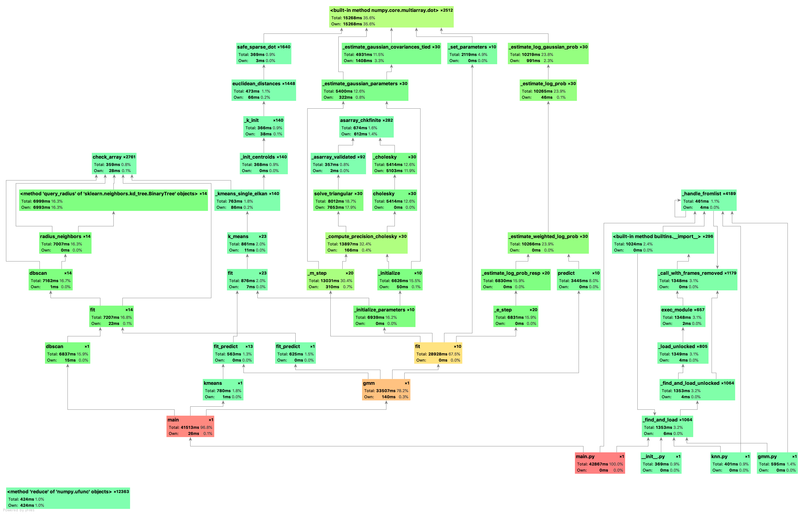

## Problem IV: GMM

*1452669, Yang LI, April 8* 

### Data Preprocessing

As the Gaussian Mixture Model works for *N* random variables that are observed, each distributed according to a mixture of *K* components, with the components belonging to the same Gaussian distributions. I use standardization to preprocess the data. Same as in Problem III, Z-score standardization has mean $0$ and standard deviation $1$. 

### Gaussian Mixture Model

Here introduce the EM algorithms.

1. Initial the parameter.

2. E-step: calculate every possibility of data from submodel.

   $P(j | x_i) = \pi_j \phi(x_i;\theta_j) / f_k (x_i)$

3. M-step: calculate new round model parameter.

   $\pi_j = \Sigma P(j | x_i) / n$

   $m_j = \Sigma P(j | x_i)x_i/(n\pi_j)$

   $C_j = \Sigma P(j | x_i)(x_i - m_j)(x_i - m_j)^T(n\pi_j)$

Following figure shows the silhouette score with number of clusters, detailed data in the fiollowing table.

| number of clusters | silhouette score     |
| ------------------ | -------------------- |
| 2                  | 0.008170664390796289 |
| 3                  | -0.17888166675017764 |
| 4                  | -0.17640449270412467 |
| 5                  | -0.17358065858275754 |
| 6                  | -0.17289004898253502 |
| 7                  | -0.17111480858695352 |
| 8                  | -0.1680206784271202  |
| 9                  | -0.16557530656981118 |
| 10                 | -0.16408006833335792 |
| 11                 | -0.16232669961509005 |
| 12                 | -0.1604467452945715  |

The accuracy please see the screenshot of running result below.

### Performance

##### Time & Space Complexity in Theory (EM algorithm)

- time complexity: $O(nki)$ where $i$ stands for the number of iterators. in theoretical is **infinite**

##### Benchmark in Practice

### Screenshot

