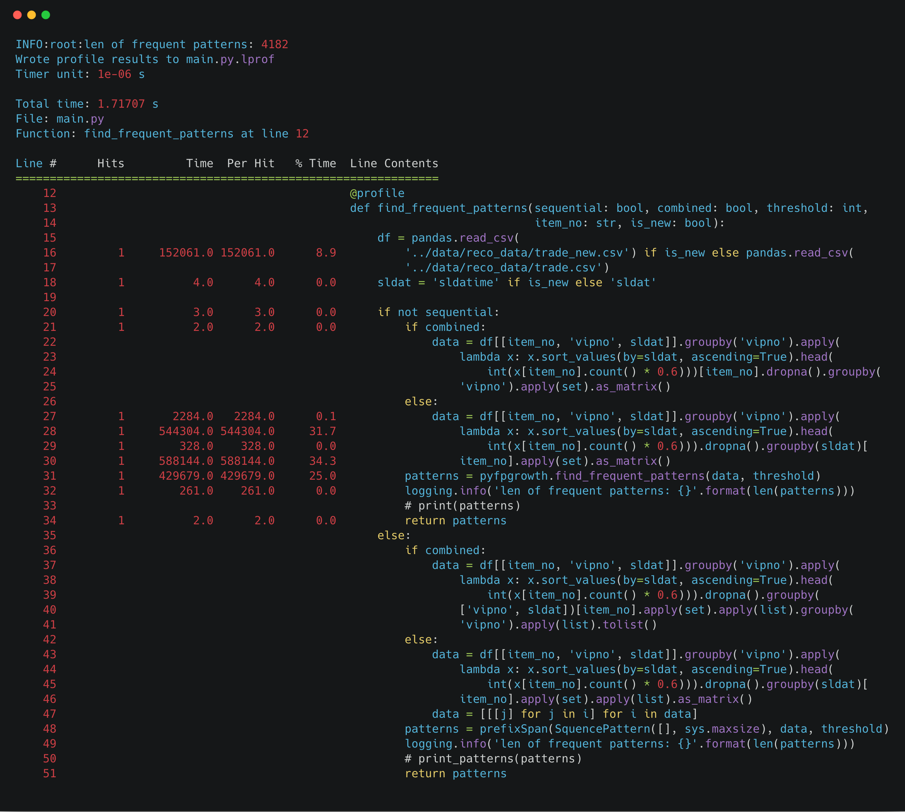
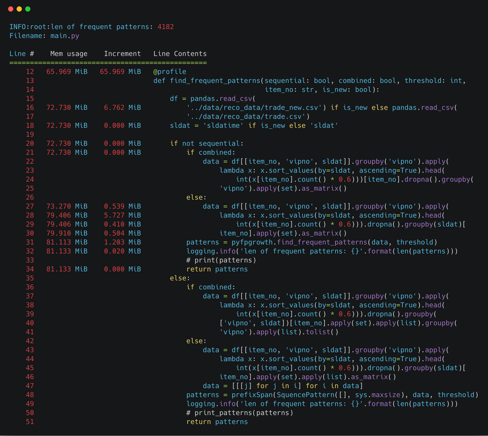
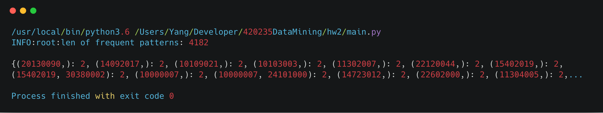
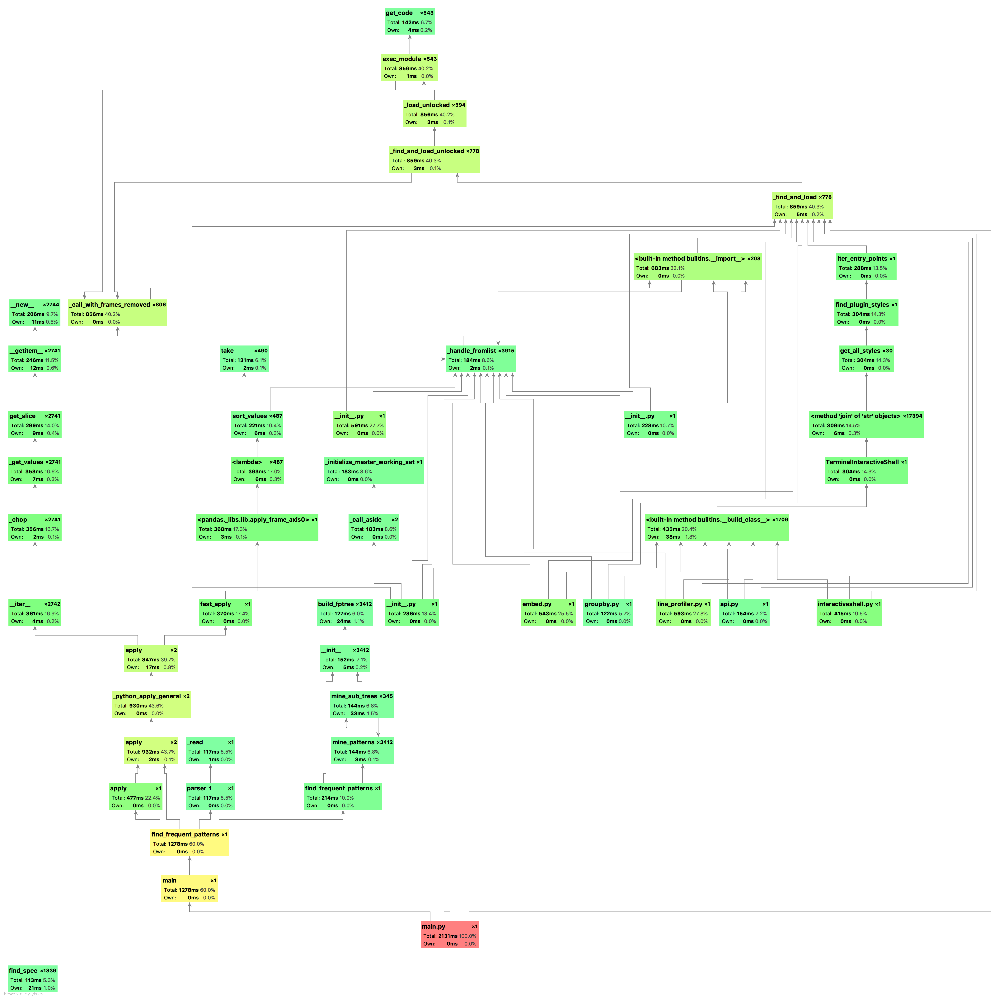

## Frequent Pattern without Sequence

*1452669, Yang LI, May 5*

### Data Processing

- Requirement: do not forget to add python path in the shell.

  ```shell
  export PYTHONPATH=$PYTHONPATH:PATHTOTHEFOLDER
  ```

- The frequent pattern result is `ai.txt` in the `a` subfolder. (with `threshold=2, item_no='pluno', is_new=True`)

- Read data as DataFrame, and using functional programming to process data.

  ```python
  df = pandas.read_csv(
          '../data/reco_data/trade_new.csv') if is_new else pandas.read_csv(
          '../data/reco_data/trade.csv')
  data = df[[item_no, 'vipno', sldat]].groupby('vipno').apply(
                  lambda x: x.sort_values(by=sldat, ascending=True).head(
                      int(x[item_no].count() * 0.6))).dropna().groupby(sldat)[
                  item_no].apply(set).as_matrix()
  ```

### Analysis

lenth of pattern in `trade.csv`:

| Support | 64   | 32   | 16   | 8    | 4    | 2    |
| ------- | ---- | ---- | ---- | ---- | ---- | ---- |
| dptno   | 14   | 38   | 96   | 241  | 738  | 3715 |
| pluno   | 7    | 21   | 51   | 130  | 384  | 1874 |
| bndno   | 3    | 9    | 12   | 33   | 107  | 393  |

lenth of pattern in `trade_new.csv`:

| Support | 64   | 32   | 16   | 8    | 4    | 2     |
| ------- | ---- | ---- | ---- | ---- | ---- | ----- |
| dptno   | 34   | 100  | 236  | 631  | 1975 | 11169 |
| pluno   | 10   | 38   | 107  | 290  | 860  | 4182  |
| bndno   | 5    | 14   | 54   | 133  | 364  | 1643  |

time cost in different support:


### Performance

##### Time & Space Complexity in Theory

Unlike Apriori Algorithm, FP-growth algorothm is quite faster since it through the data twice to store it in the FP Tree, note that FP is a real implementation of Apriori, since every candidate itemset is known to have two frequent subsets. 

- Time Complexity: $O(header\_count^2 * depth\_of\_tree)$ =  $O(n^2)$

##### Benchmark in Practice





### Screenshot



