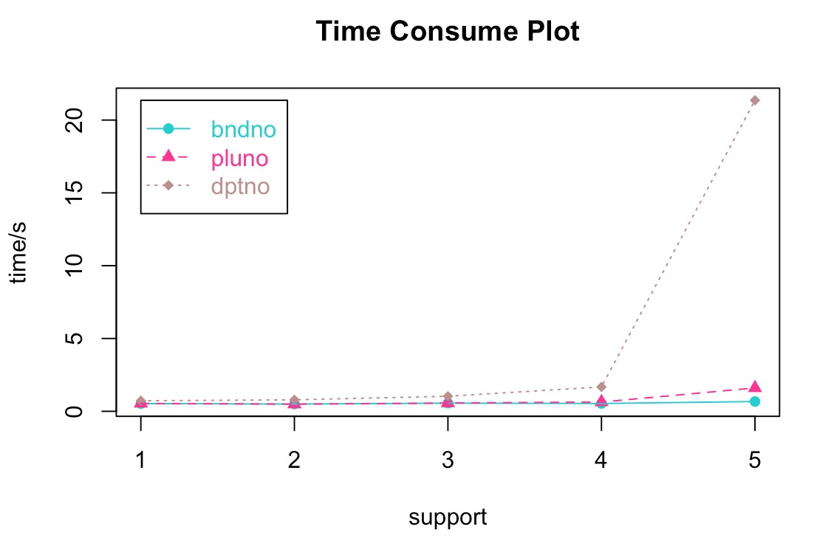
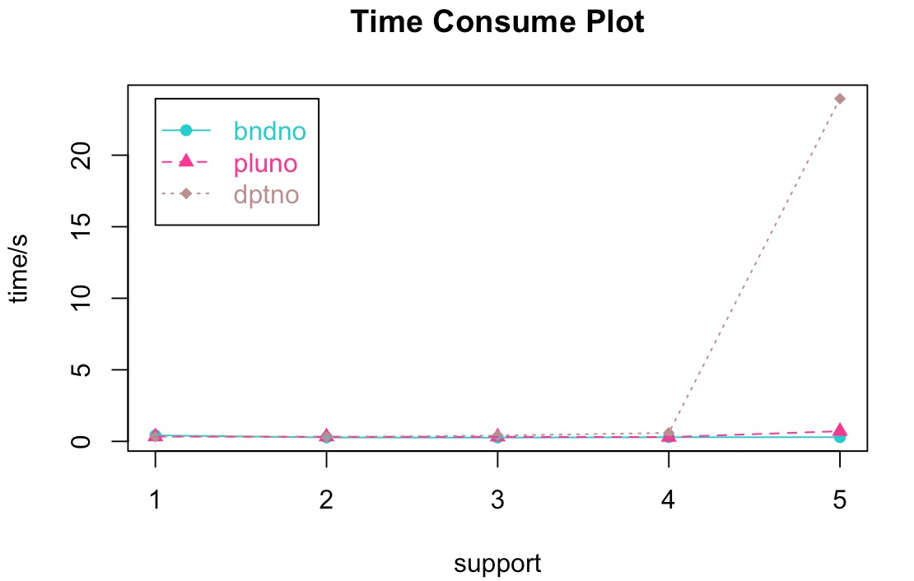
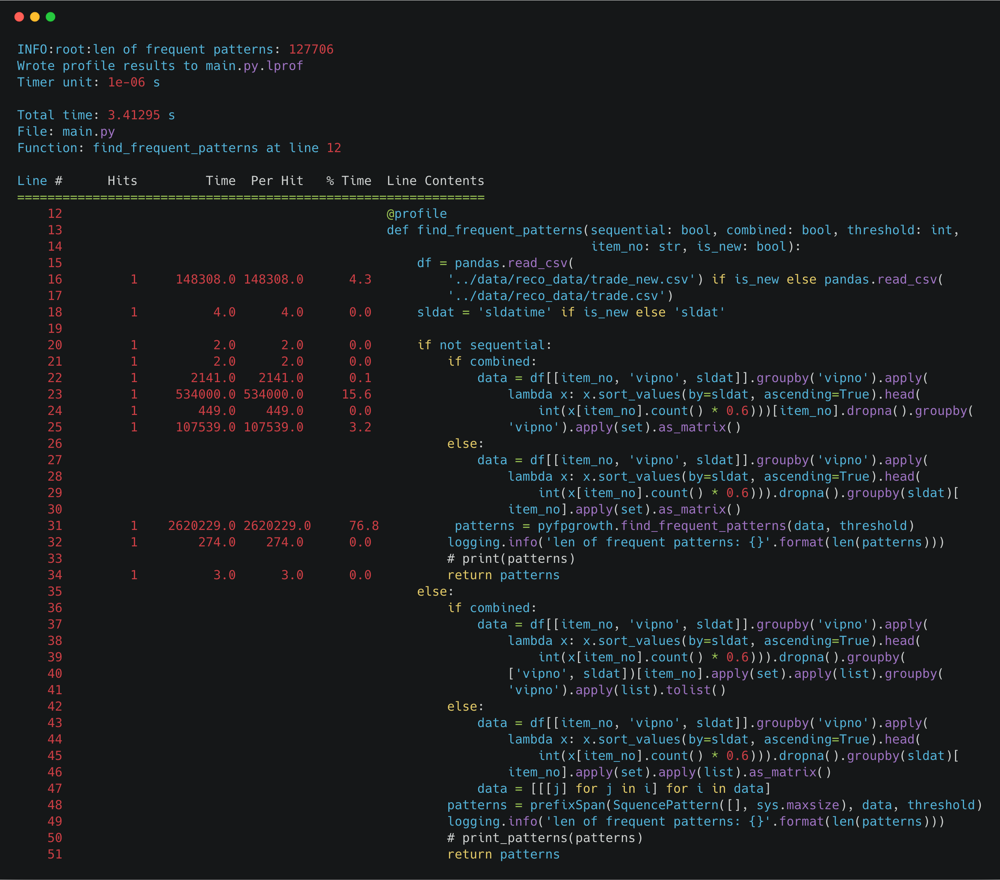
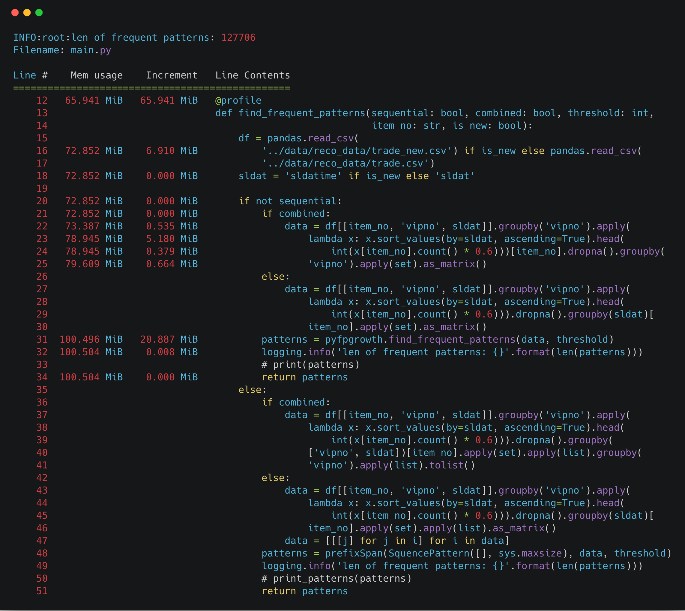
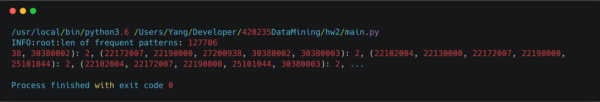
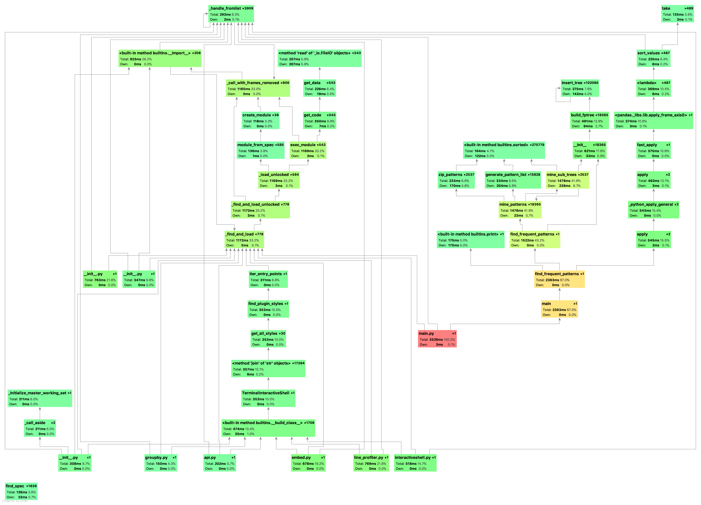

## Frequent Pattern without Sequence

*1452669, Yang LI, May 5*

### Data Processing

- Requirement: do not forget to add python path in the shell.

  ```shell
  export PYTHONPATH=$PYTHONPATH:PATHTOTHEFOLDER
  ```

- The frequent pattern result is `aii.txt` in the `a` subfolder. (with `threshold=2, item_no='pluno', is_new=True`)

- Read data as DataFrame, and using functional programming to process data.

  ```python
  df = pandas.read_csv(
          '../data/reco_data/trade_new.csv') if is_new else pandas.read_csv(
          '../data/reco_data/trade.csv')
  data = df[[item_no, 'vipno', sldat]].groupby('vipno').apply(
                  lambda x: x.sort_values(by=sldat, ascending=True).head(
                      int(x[item_no].count() * 0.6)))[item_no].dropna().groupby(
                  'vipno').apply(set).as_matrix()
  ```

### Analysis

lenth of pattern in `trade.csv`:

| Support | 10   | 8    | 6    | 4     | 2       |
| ------- | ---- | ---- | ---- | ----- | ------- |
| dptno   | 573  | 1130 | 3150 | 19283 | 3931272 |
| pluno   | 98   | 170  | 350  | 1120  | 62696   |
| bndno   | 23   | 39   | 59   | 137   | 935     |

lenth of pattern in `trade_new.csv`:

| Support | 10   | 8    | 6    | 4     | 2       |
| ------- | ---- | ---- | ---- | ----- | ------- |
| dptno   | 2346 | 4161 | 9494 | 36987 | 2923860 |
| pluno   | 327  | 525  | 1039 | 3210  | 127706  |
| bndno   | 126  | 198  | 368  | 918   | 13388   |

time cost in different support:

- new

  

- old

  

### Performance

##### Time & Space Complexity in Theory

Unlike Apriori Algorithm, FP-growth algorothm is quite faster since it through the data twice to store it in the FP Tree, note that FP is a real implementation of Apriori, since every candidate itemset is known to have two frequent subsets. 

- Time Complexity: $O(header\_count^2 * depth\_of\_tree)$ =  $O(n^2)​$

##### Benchmark in Practice





### Screenshot



