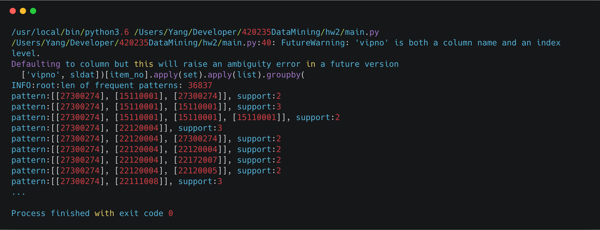

## Frequent Pattern with Sequence

*1452669, Yang LI, May 5*

### Data Processing

- Requirement: do not forget to add python path in the shell.

  ```shell
  export PYTHONPATH=$PYTHONPATH:PATHTOTHEFOLDER
  ```

- The frequent pattern result is `bii.txt` in the `b` subfolder. (with `threshold=2, item_no='pluno', is_new=True`)

- Read data as DataFrame, and using functional programming to process data.

  ```python
  df = pandas.read_csv(
          '../data/reco_data/trade_new.csv') if is_new else pandas.read_csv(
          '../data/reco_data/trade.csv')
  data = df[[item_no, 'vipno', sldat]].groupby('vipno').apply(
                  lambda x: x.sort_values(by=sldat, ascending=True).head(
                      int(x[item_no].count() * 0.6))).dropna().groupby(
                  ['vipno', sldat])[item_no].apply(set).apply(list).groupby(
                  'vipno').apply(list).tolist()
  ```

### Analysis

lenth of pattern in `trade.csv`:

| Support | 10   | 8    | 6    | 4    | 2       |
| ------- | ---- | ---- | ---- | ---- | ------- |
| dptno   | 470  | 822  | 1967 | 8330 | 1145894 |
| pluno   | 98   | 162  | 319  | 954  | 39546   |
| bndno   | 22   | 40   | 71   | 157  | 1040    |

lenth of pattern in `trade_new.csv`:

| Support | 10   | 8    | 6    | 4     | 2      |
| ------- | ---- | ---- | ---- | ----- | ------ |
| dptno   | 1739 | 2987 | 6289 | 21275 | 997834 |
| pluno   | 285  | 440  | 826  | 2277  | 36837  |
| bndno   | 125  | 188  | 331  | 790   | 7961   |

time cost in different support:

- new

  

- old

  

### Performance

##### Time & Space Complexity in Theory

We use PrefixSpan algorithm to implement the Frequent Pattern Mining with Sequence, it can divide into several parts.

- Find length-1 sequential patterns

  The given sequence S is scanned to get item (prefix) that occurred frequently in S. For the number of time that item occurs is equal to length-l of that item. Length-l is given by notation \<pattern>: \<count>.

- Divide search soace

  Based on the prefix that derived from first step, the whole sequential pattern set is partitioned in this phase. 

- FInd subsets of sequential patterns

  The projected databases are constructed and sequential patterns are mined from these databases. Only local frequent sequences are explored in projected databases so as to expand the sequential patterns. The cost for constructing projected database is quite high. Bi-level projection and pseudo-projection methods are used to reduce this cost which ultimately increases the algorithm’s efficiency.

##### Benchmark in Practice


### Screenshot



