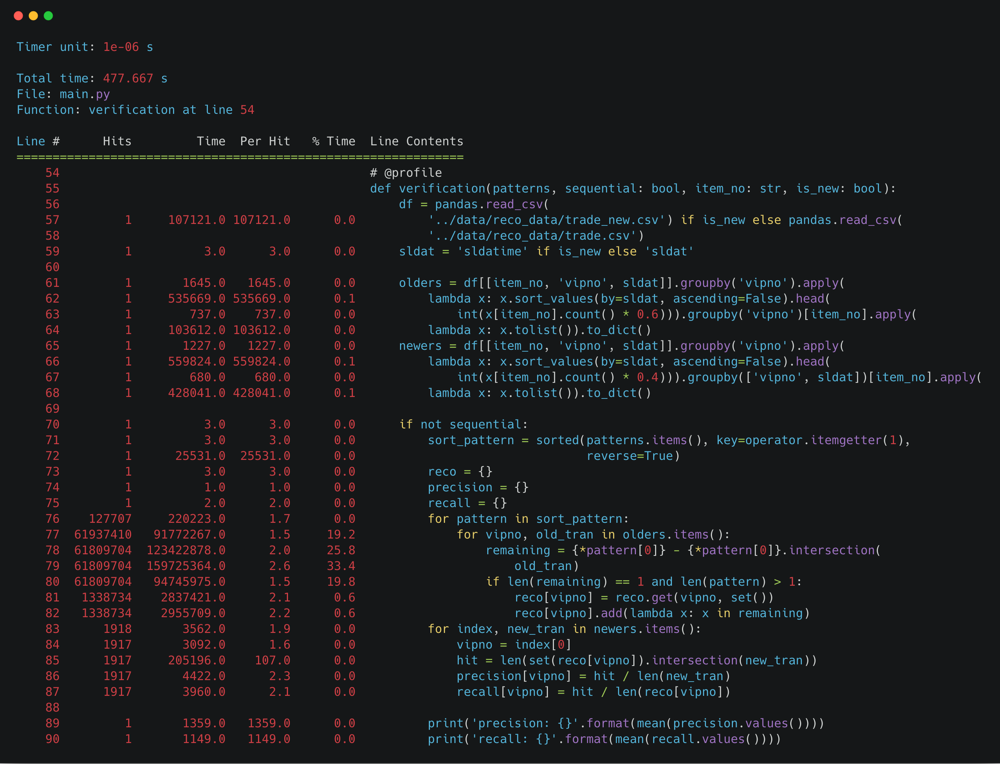
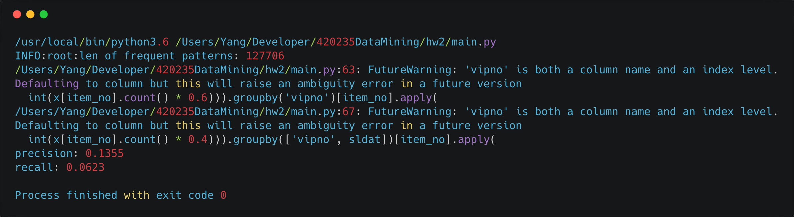
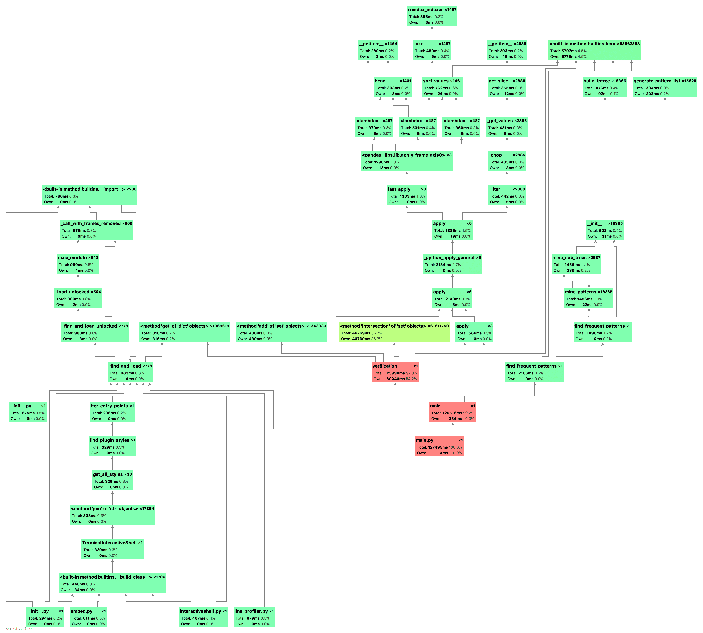

## Predict using Frequent Pattern

*1452669, Yang LI, May 5*

### Data Processing

- Requirement: do not forget to add python path in the shell.

  ```shell
  export PYTHONPATH=$PYTHONPATH:PATHTOTHEFOLDER
  ```

- Read data as DataFrame, and using functional programming to process data.

  ```python
  def verification(patterns, sequential: bool, item_no: str, is_new: bool):
      df = pandas.read_csv(
          '../data/reco_data/trade_new.csv') if is_new else pandas.read_csv(
          '../data/reco_data/trade.csv')
      sldat = 'sldatime' if is_new else 'sldat'
  
      olders = df[[item_no, 'vipno', sldat]].groupby('vipno').apply(
          lambda x: x.sort_values(by=sldat, ascending=False).head(
              int(x[item_no].count() * 0.6))).groupby('vipno')[item_no].apply(
          lambda x: x.tolist()).to_dict()
      newers = df[[item_no, 'vipno', sldat]].groupby('vipno').apply(
          lambda x: x.sort_values(by=sldat, ascending=False).head(
              int(x[item_no].count() * 0.4))).groupby(['vipno', sldat])[item_no].apply(
          lambda x: x.tolist()).to_dict()
  
      if not sequential:
          sort_pattern = sorted(patterns.items(), key=operator.itemgetter(1),
                                reverse=True)
          reco = {}
          precision = {}
          recall = {}
          for pattern in sort_pattern:
              for vipno, old_tran in olders.items():
                  remaining = {*pattern[0]} - {*pattern[0]}.intersection(
                      old_tran)
                  if len(remaining) == 1 and len(pattern) > 1:
                      reco[vipno] = reco.get(vipno, set())
                      reco[vipno].add(lambda x: x in remaining)
          for index, new_tran in newers.items():
              vipno = index[0]
              hit = len(set(reco[vipno]).intersection(new_tran))
              precision[vipno] = hit / len(new_tran)
              recall[vipno] = hit / len(reco[vipno])
  
          print('precision: {}'.format(mean(precision.values())))
          print('recall: {}'.format(mean(recall.values())))
  ```

### Analysis

In the field of information retrieval, precision is the fraction of retrieved documents that are relevant(information_retrieval)) to the query:

$Precision = \frac{|\{relevant\ documents\}\cap\{retrieved\ document\}|}{|\{retrieved\ ducoments\}|} = \frac{tn}{fp+tp}$

For example, for a text search on a set of documents, precision is the number of correct results divided by the number of all returned results.

 In information retrieval, recall is the fraction of the relevant documents that are successfully retrieved. 

$Recall = \frac{|\{relevant\ documents\}\cap\{retrieved\ document\}|}{|\{retrieved\ ducoments\}|} = \frac{tp}{tp+fn}$

with different support, we have the following precision and recall:

| support   | 10     | 8      | 6      | 4      |
| --------- | ------ | ------ | ------ | ------ |
| precision | 0.1355 | 0.1134 | 0.1021 | 0.0697 |
| recall    | 0.0623 | 0.0784 | 0.1137 | 0.2045 |

### Performance

##### Benchmark in Practice



### Screenshot






