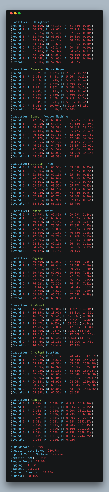
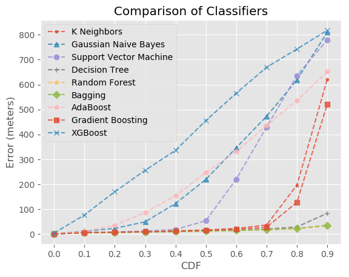
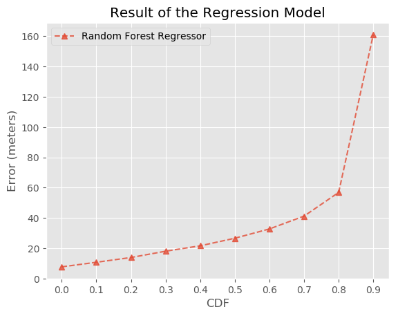
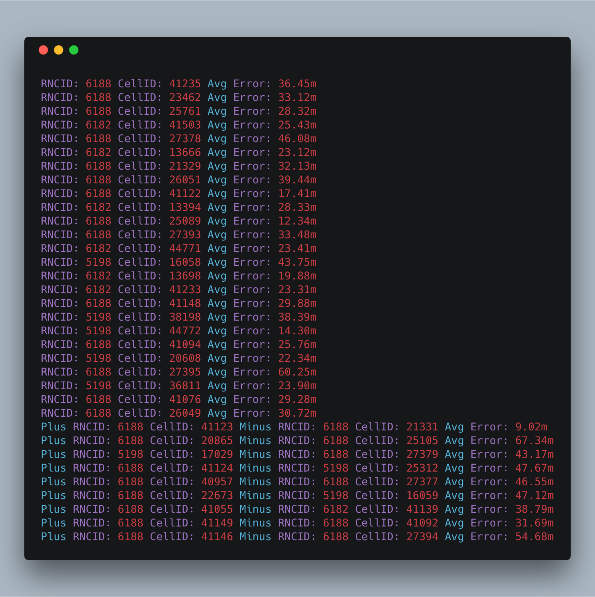

# HW3-1

### 数据预处理

首先通过读取数据, 进行基本的数据预处理. RSSI表示已知发射功率, 在接收节点测量接收功率, 计算传播损耗, 使用理论或经验的信号传播模型将传播损耗转化为距离. 针对不存在这个数据的情况, 我们认为没有接受到这个数据, 故而直接填充-110. 

在栅格化GPS的部分, 我们把经纬度数据转化为坐标. 最后在图上表现出来. 下图体现了点的位置和栅格化后的位置.


### A

我们在原始MR数据中的连接的基站数, RSSI数值和经纬度等特征. 对于基站数目不够的情况, 我们填充-1进行处理. 然后我们对栅格化的数据训练9个分类器. 我们通过先随机挑选一部分数据来优化参数.

在数据中, 我们随机选取80%的数据作为训练集, 剩下的20%作为测试集, 重复训练10次, 求平均误差. 并使用precision,  recall, f-measurement 进行评价. 

具体的模型和参数如下.

```python
models = {
    'K Neighbors': KNeighborsClassifier(n_neighbors=2),
    'Gaussian Naive Bayes': GaussianNB(),
    'Support Vector Machine': SVC(),
    'Decision Tree': DecisionTreeClassifier(criterion='entropy', max_depth=50),
    'Random Forest': RandomForestClassifier(max_features=3, n_estimators=45),
    'Bagging': BaggingClassifier(n_estimators=40),
    'AdaBoost': AdaBoostClassifier(n_estimators=150, learning_rate=0.1),
    'Gradient Boosting': GradientBoostingClassifier(max_depth=10, n_estimators=40),
    'XGBoost': None,
}
```

输出如下:





### C

根据每个MR记录的主基站进行分组, 计算其实际经纬度与基站的相对距离, 并针对每一个分组使用回归模型来预测每一条数据的坐标, 对每组数据重复10次实验, 得到误差, 其中模型具体参数如下.

```python
clf = RandomForestRegressor(max_depth=10, n_estimators=100)

X_train, y_train = prepare_dataset_with_station(train_data)
X_test, y_test = prepare_dataset_with_station(test_data)

clf.fit(X_train, y_train['Latitude'])
y_predict_latitude = clf.predict(X_test)
clf.fit(X_train, y_train['Longitude'])
y_predict_longitude = clf.predict(X_test)
```

我们使用随机森林分类器对两层模型进行训练. 为保证轨迹信息的完整性, 我们根据IMSI对训练集和测试集进行分割. 结果包括将所有分组的误差合并之后计算误差概率分布均值, 对每个分组进行排序, 取前top数据做组间平均的结果.



### D

我们根据C中得到的分组模型的误差进行排序, 选取误差最小和最大的k个分组. 将最大的MR数据结合最小的MR数据, 重新处理C中的定位步骤, 进行比较. 具体参数如下:

```python
clf = RandomForestRegressor(max_depth=10, n_estimators=100)

round_count = 10
down_sampling_count = 10
```

输出结果:



