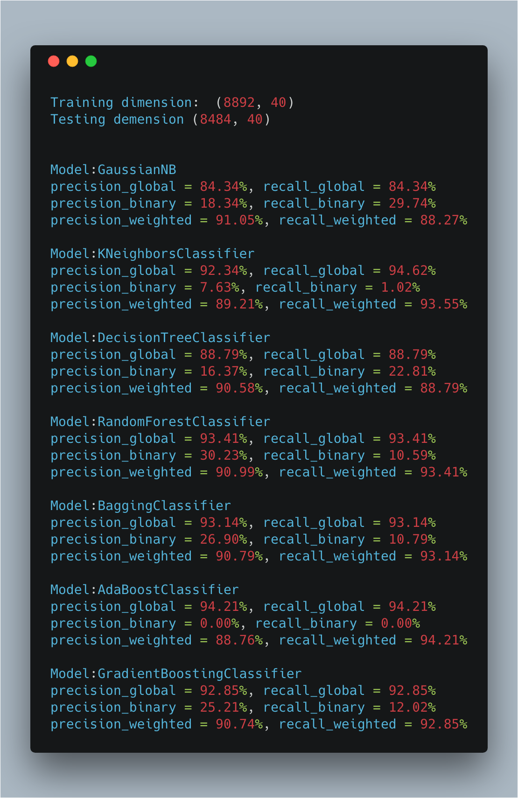

# HW3-2

### 数据预处理

对读取的年龄数据分区间进行离散化数量, 能更好的反应顾客的年龄特征差异. 此外对品牌名的缺省值使用-1代替, 对性别数据也进行离散化的处理. 最后为了方便后续的特征提取, 我们对列进行了重命名.

### A: 特征提取

我们通过维护一个结构为`defaultdict(lambda: defaultdict(dict))`的feature变量, 进行大量的特征提取.

每一个特征的分类均为一个函数, 通过大量的封装, 我们对实现了对类似功能的代码复用.

#### PART I: count/ratio - count

```python
def count(df: pandas.DataFrame, features: defaultdict, recent=''):
    period = ['monthly', 'whole'] if recent is '' else [recent]
    objects = ['vip_no', 'brand_no', 'category_no', 'item_id']
    duo_objs = [(0, 1), (0, 2), (0, 3), (1, 2)]
    norms = {'count': list.__len__, 'amount': sum, 'purchase_day': (lambda x: len(set(x)))}
    raw = defaultdict(lambda: defaultdict(lambda: defaultdict(list)))

    for index, row in df.iterrows():
        for norm in norms.keys():
            for obj in objects:
                raw[period[0] + brief(obj) + norm][row[obj]][row['order_time'].month].append(row[norm])
            for duo_index in duo_objs:
                raw[period[0] + brief(objects[duo_index[0]], objects[duo_index[1]]) + norm][
                    objects[duo_index[0]] + '_' + objects[duo_index[1]]][row['order_time'].month].append(row[norm])

    for norm in norms.keys():
        for obj in objects:
            for obj_key, obj_value in raw[period[0] + brief(obj) + norm].items():
                tmp = []
                for time, item in obj_value.items():
                    tmp += item
                    features[period[0] + brief(obj) + norm][obj_key][time] = norms[norm](item)
                features[period[1] + brief(obj) + norm][obj_key][period[1]] = norms[norm](tmp)
        for duo_index in duo_objs:
            for obj_key, obj_value in raw[
                period[0] + brief(objects[duo_index[0]], objects[duo_index[1]]) + norm].items():
                tmp = []
                for time, item in obj_value.items():
                    tmp += item
                    features[period[0] + brief(objects[duo_index[0]], objects[duo_index[1]]) + norm][obj_key][time] = \
                        norms[norm](item)
                features[period[1] + brief(objects[duo_index[0]], objects[duo_index[1]]) + norm][obj_key][period[1]] = \
                    norms[norm](tmp)
```

#### PART I: count/ratio - product diversity

```python
def product_diversity(df: pandas.DataFrame, features: defaultdict, recent=''):
    period = ['monthly', 'whole'] if recent is '' else [recent]
    objects = ['vip_no', 'brand_no', 'category_no', 'item_id']
    raw = defaultdict(lambda: defaultdict(lambda: defaultdict(set)))

    for index, row in df.iterrows():
        for obj in objects[1:]:
            raw[period[0] + brief(obj) + 'unique'][row[objects[0]]][row['order_time'].month].add(row[obj])
        raw[period[0] + brief(objects[1], objects[2]) + 'unique'][(row[objects[1]], row[objects[2]])][
            row['order_time'].month].add(row[objects[3]])

    for obj in objects[1:]:
        for obj_key, obj_value in raw[period[0] + brief(obj) + 'unique'].items():
            tmp = set()
            for time, item in obj_value.items():
                tmp.update(item)
                features[period[0] + brief(obj) + 'unique'][obj_key][time] = len(item)
            features[period[1] + brief(obj) + 'unique'][obj_key][period[1]] = len(tmp)
        for obj_key, obj_value in raw[period[0] + brief(objects[1], objects[2]) + 'unique'].items():
            tmp = set()
            for time, item in obj_value.items():
                tmp.update(item)
                features[period[0] + brief(objects[1], objects[2]) + 'unique'][obj_key][time] = len(item)
            features[period[1] + brief(objects[1], objects[2]) + 'unique'][obj_key][period[1]] = len(tmp)
```

#### PART I: count/ratio - penetration

```python
def penetration(df: pandas.DataFrame, features: defaultdict, recent=''):
    period = ['monthly', 'whole'] if recent is '' else [recent]
    objects = ['vip_no', 'brand_no', 'category_no', 'item_id']
    raw = defaultdict(lambda: defaultdict(lambda: defaultdict(set)))

    for index, row in df.iterrows():
        for obj in objects[1:]:
            raw[period[0] + brief(obj) + 'unique_vip'][row[obj]][row['order_time'].month].add(row[objects[0]])

    for obj in objects[1:]:
        for obj_key, obj_value in raw[period[0] + brief(obj) + 'unique_vip'].items():
            tmp = set()
            for time, item in obj_value.items():
                tmp.update(item)
                features[period[0] + brief(obj) + 'unique_vip'][obj_key][time] = len(item)
            features[period[1] + brief(obj) + 'unique_vip'][obj_key][period[1]] = len(tmp)
```

#### PART II: AGG feature - month AGG

```python
def month_agg(df: pandas.DataFrame, features: defaultdict):
    agg = {'mean': numpy.mean, 'std': numpy.std, 'max': numpy.max, 'median': numpy.median}

    for raw_feature in features.keys():
        if 'month' in raw_feature:
            for obj_key, obj_value in features[raw_feature].item():
                agg_feature = raw_feature.replace('month', 'month_agg')
                for agg_name, agg_method in agg.items():
                    features[agg_feature][obj_key][agg_name] = agg_method(numpy.array(obj_value.values()))
```

#### PART II: AGG feature - user AGG

```python
def user_agg(df: pandas.DataFrame, features: defaultdict):
    objects = ['vip_no', 'brand_no', 'category_no', 'item_id']
    norms = {'count': list.__len__, 'amount': sum, 'purchase_day': (lambda x: len(set(x)))}
    agg = {'mean': numpy.mean, 'std': numpy.std, 'max': numpy.max, 'median': numpy.median}
    raw = defaultdict(lambda: defaultdict(lambda: defaultdict(list)))
    tmp = defaultdict(lambda: defaultdict(dict))

    for index, row in df.iterrows():
        for norm in norms.keys():
            for obj in objects[1:]:
                raw['user_agg' + brief(obj) + norm][row[obj]][row[objects[0]]].append(row[norm])

    for norm in norms.keys():
        for obj in objects[1:]:
            agg_feature = 'user_agg' + brief(obj) + norm
            for obj_key, obj_value in raw[agg_feature].items():
                for user, item in obj_value.items():
                    tmp[agg_feature][obj_key][user] = norms[norm](item)
            for obj_key, obj_value in tmp[agg_feature].items():
                for agg_name, agg_method in agg.items():
                    features[agg_feature][obj_key][agg_name] = agg_method(numpy.array(obj_value.values()))
```

#### PART II: AGG feature - brand/category/item AGG

```python
def obj_agg(df: pandas.DataFrame, features: defaultdict):
    objects = ['vip_no', 'brand_no', 'category_no', 'item_id']
    norms = {'count': list.__len__, 'amount': sum, 'purchase_day': (lambda x: len(set(x)))}
    agg = {'mean': numpy.mean, 'std': numpy.std, 'max': numpy.max, 'median': numpy.median}
    raw = defaultdict(lambda: defaultdict(lambda: defaultdict(list)))
    tmp = defaultdict(lambda: defaultdict(dict))

    for index, row in df.iterrows():
        for norm in norms.keys():
            for obj in objects[1:]:
                raw['obj_agg' + brief(obj) + norm][row[objects[0]]][row[obj]].append(row[norm])

    for norm in norms.keys():
        for obj in objects[1:]:
            agg_feature = 'obj_agg' + brief(obj) + norm
            for user_key, user_value in raw[agg_feature].items():
                for obj_name, item in user_value.items():
                    tmp[agg_feature][user_key][obj_name] = norms[norm](item)
            for user_key, user_value in tmp[agg_feature].items():
                for agg_name, agg_method in agg.items():
                    features[agg_feature][user_key][agg_name] = agg_method(numpy.array(user_value.values()))
```

#### PART III: last week/ month feature

```python
def recent_feature(df: pandas.DataFrame, features: defaultdict):
    period = ['last_month', 'last_week']
    recent_df = {}
    month_begin = df['order_time'].max - pandas.offsets.relativedelta(months=1)
    week_begin = df['order_time'].max - pandas.offsets.relativedelta(weeks=1)
    recent_df[period[0]] = df.loc[(df['order_time'] > month_begin)]
    recent_df[period[1]] = df.loc[(df['order_time'] > week_begin)]

    for recent in period:
        # PART I: count/ratio
        count(recent_df[recent], features, recent)
        product_diversity(recent_df[recent], features, recent)
        penetration(recent_df[recent], features, recent)

        # PART II: AGG feature
        user_agg(recent_df[recent], features)
        obj_agg(recent_df[recent], features)
```

#### PART IV: complex feature - trend

```python
def trend(df: pandas.DataFrame, features: defaultdict):
    # use z-score to normalize
    for feature_name, feature_value in features.keys():
        if 'monthly' in feature_name:
            for obj_key, obj_value in feature_value.items():
                coefficient = numpy.vstack([obj_value.keys(), numpy.ones(len(obj_value.keys()))]).T
                trend_slope = feature_name.replace('monthly', 'trend_slope')
                features[trend_slope][obj_key]['slope'] = numpy.linalg.lstsq(coefficient, obj_value.values())[0]

                trend_bias = feature_name.replace('monthly', 'trend_bias')
                index, last_month = max(enumerate(obj_value.keys()), key=operator.itemgetter(1))
                all_value = numpy.array(obj_value.values())
                features[trend_bias][obj_key]['bias'] = stats.zscore(all_value)[index]
```

#### PART IV: complex feature - repeat feature

```python
def repeat_feature(df: pandas.DataFrame, features: defaultdict):
    objects = ['vip_no', 'brand_no', 'category_no', 'item_id']
    raw = defaultdict(lambda: defaultdict(lambda: defaultdict(list)))

    # group by brand/category/item
    for index, row in df.iterrows():
        for obj in objects[1:]:
            raw['repeat' + brief(obj) + brief(objects[0])][row[obj]][row['order_time']].append(row[objects[0]])

    for obj in objects[1:]:
        for obj_key, obj_value in raw['repeat' + brief(obj) + brief(objects[0])].items():
            tmp = {}
            for time, vips in obj_value.items():
                for vip in vips:
                    tmp.setdefault(vip, set()).add(time)
            count = [key for key, values in tmp.items() if len(values) > 1].__len__()
            total = tmp.keys().__len__()
            features['repeat' + brief(obj) + brief(objects[0])][obj_key]['count'] = count
            features['repeat' + brief(obj) + brief(objects[0])][obj_key]['total'] = total

            count = [key for key, values in obj_value.items() if len(values) > 1].__len__()
            total = obj_value.keys().__len__()
            features['repeat' + brief(obj) + 'day'][obj_key]['count'] = count
            features['repeat' + brief(obj) + 'day'][obj_key]['total'] = total

    # group by vip
    for index, row in df.iterrows():
        for obj in objects[1:]:
            raw['repeat' + brief(objects[0]) + brief(obj)][row[objects[0]]][row['order_time']].append(row[obj])

    for obj in objects[1:]:
        for obj_key, obj_value in raw['repeat' + brief(objects[0]) + brief(obj)].items():
            tmp = {}
            for time, vips in obj_value.items():
                for vip in vips:
                    tmp.setdefault(vip, set()).add(time)
            count = [key for key, values in tmp.items() if len(values) > 1].__len__()
            total = tmp.keys().__len__()
            features['repeat' + brief(objects[0]) + brief(obj)][obj_key]['count'] = count
            features['repeat' + brief(objects[0]) + brief(obj)][obj_key]['total'] = total

            count = [key for key, values in obj_value.items() if len(values) > 1].__len__()
            total = obj_value.keys().__len__()
            features['repeat' + brief(objects[0]) + 'day'][obj_key]['count'] = count
            features['repeat' + brief(objects[0]) + 'day'][obj_key]['total'] = total
```

#### PART IV: complex feature - market share

```python
def market_share(df: pandas.DataFrame, features: defaultdict):
    objects = ['brand_no', 'category_no']
    objects.append(tuple(objects))
    norms = {'order_id': set.__len__, 'vip_no': set.__len__}
    raw = defaultdict(lambda: defaultdict(lambda: defaultdict(set)))

    for index, row in df.iterrows():
        for norm in norms.keys():
            for obj in objects:
                if type(obj) is not list:
                    raw['market_share' + brief(obj) + norm][(row[obj])][row['order_time']].add(row[norm])
                else:
                    raw['market_share' + brief(*obj) + norm][(row[objects[0]], row[objects[1]])][row['order_time']].add(
                        row[norm])

    # TODO: optimize brief func to reduce duplicated code
    for norm in norms.keys():
        vars()[norm.split('_')[0] + '_cnt'] = defaultdict(lambda: defaultdict(int))
        for obj in objects:
            if type(obj) is not list:
                for obj_key, obj_value in raw['market_share' + brief(obj) + norm].items():
                    for time, item in obj_value:
                        vars()[norm.split('_')[0] + '_cnt'][obj_key] += norms[norm](item)
            else:
                for obj_key, obj_value in raw['market_share' + brief(*obj) + norm].items():
                    for time, item in obj_value:
                        vars()[norm.split('_')[0] + '_cnt'][obj_key] += norms[norm](item)

    for norm in norms.keys():
        for obj in objects:
            if type(obj) is not list:
                for obj_key, obj_value in vars()[norm.split('_')[0] + '_cnt']:
                    if type(obj_key) is not tuple:
                        features['market_share' + brief(obj)][obj_key][brief(norm)] = \
                            vars()[norm.split('_')[0] + '_cnt'][(objects[0], objects[1])] / \
                            vars()[norm.split('_')[0] + '_cnt'][obj_key]
```

#### PART IV: complex feature - user-brand/ category

```python
def similarity(df: pandas.DataFrame, features: defaultdict):
    objects = ['brand_no', 'category_no']
    methods = {'max': numpy.max, 'sum': numpy.sum, 'avg': numpy.mean}
    proportions = {'order_cnt': 'quantity', 'vip_cnt': 'vip_no'}
    raw = defaultdict(lambda: defaultdict(lambda: defaultdict(set)))

    for index, row in df.iteritems():
        for obj in objects:
            another_obj = list(set(objects) - set([obj]))[0]
            for pro in proportions:
                for method in methods:
                    raw[brief(obj) + method + pro][row[obj]][row[another_obj]].add(
                        row[proportions[pro]])

    # for obj in objects:
    #     another_obj = list(set(objects) - set([obj]))[0]
    #     for pro in proportions:
    #         for method in methods:
    #             for obj_key, obj_value in raw[brief(obj) + method + pro].items():
    #                 features['similarity' + brief(obj) + method + pro][obj_key] =
```

### B

根据上述提取的特征, 我们使用第K个月的数据作为训练集, 设计多元二分类模型, 通过预测用户-商品的交易记录是否在下个月出现来评价模型的好坏.

运行结果如下:



### C.i

利用2, 3, 4月份的数据作为特征, 5月份的数据作为标签作为训练机, 预测用户购买的可能性.

具体结果如下:


### C.ii

对用户购买的商品品牌作为多标签分类器的类别. 进行类似预测.

结果如下:


### C.iii

对用户和类别进行预测. 方法同上.

结果如下:


### C.iv

进行回归预测用户下一个月的消费金额.

具体结果如下:


